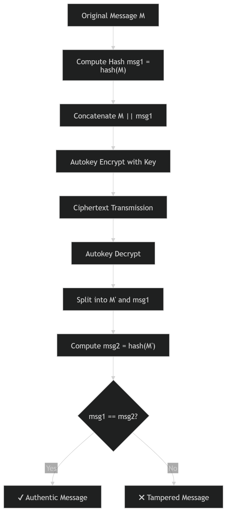

# 📘 Autokey Cipher with Message Integrity Verification using Custom Hash Function
## 📌 Overview

This project implements a secure message transmission mechanism by combining:

A custom polynomial rolling hash function for integrity verification
The Autokey Cipher (Vigenère-based) for encryption
A verification mechanism to detect tampering
✔ Guarantees
- Confidentiality → via encryption
- Integrity → via hash verification


## ⚙️ System Workflow
## 🔄 Flowchart Diagram

<p align="center">
  
</p>

## 🔹 Sender Side

```
msg1 = hashfxn1(M)
new_msg = M || msg1
C = Autokey_Encrypt(new_msg, key)
```

## 🔹 Receiver Side
```
new_msg = Autokey_Decrypt(C, key)

original_msg = first N characters
msg1 = remaining

msg2 = hashfxn1(original_msg)

if msg1 == msg2 → authentic
else → tampered
```

## Hash Function Design
📌 Definition

`h=(h×BASE+ord(char))mod(261−1)`

## 🔍 Base Selection (31 vs 131)
✔ Base = 31
Efficient: (h << 5) - h
Common in practice
Fast computation
✔ Base = 131 (Used)
Better distribution
Lower collision probability
Less predictable patterns
✅ Justification

131 is chosen to prioritize collision resistance and better hash distribution over computational optimization. 

## 🔑 Autokey Cipher
Keystream
`Keystream = KEY || PLAINTEXT`

## Encryption
C[i]=(P[i]+K[i])mod26


## Decryption
P[i]=(C[i]−K[i])mod26 


### CODE:

```python
def hashfxn1(message: str) -> str:
    MOD = (1 << 61) - 1
    BASE = 131
    h = 0
    for ch in message:
        h = (h * BASE + ord(ch)) % MOD
    # Return as hex string
    return format(h, '016X')

def autokey_encrypt_raw(plaintext, key):
    key_stream = (key + plaintext)[:len(plaintext)]
    cipher = ""
    for p, k in zip(plaintext, key_stream):
        # Shift using ASCII values
        val = (ord(p) + ord(k)) % 256
        cipher += chr(val)
    return cipher

def autokey_decrypt_raw(ciphertext, key):
    plaintext = ""
    key_stream = key
    
    for i in range(len(ciphertext)):
        k = key_stream[i]
        val = (ord(ciphertext[i]) - ord(k)) % 256
        p = chr(val)
        plaintext += p
        key_stream += p
        
    return plaintext

# ================= SENDER =================
def encrypt_message(original_msg, key):
    # 1. Compute hash
    msg_hash = hashfxn1(original_msg)
    
    # 2. Append hash to original (preserving spaces/case)
    combined_msg = original_msg + "|" + msg_hash # Use a separator
    
    # 3. Encrypt
    cipher = autokey_encrypt_raw(combined_msg, key)
    return cipher

# ================= RECEIVER =================
def decrypt_message(ciphertext, key):
    # 1. Decrypt full string
    full_decrypted = autokey_decrypt_raw(ciphertext, key)
    
    # 2. Split by the separator we added
    if "|" in full_decrypted:
        original_msg, received_hash = full_decrypted.rsplit("|", 1)
        # 3. Verify
        computed_hash = hashfxn1(original_msg)
        is_authentic = (received_hash == computed_hash)
        return original_msg, is_authentic
    
    return full_decrypted, False


def main():
    print("\n=== Autokey Cipher (v2: Space & Case Preserved) ===\n")

    message = input("Enter original message: ") 
    key = input("Enter secret key: ")

    cipher = encrypt_message(message, key)

    print("\n--- SENDER SIDE ---")
    print(f"Original Message : '{message}'")
 
    print(f"Cipher (Hex)     : {cipher.encode().hex().upper()[:40]}...")

    decrypted_msg, status = decrypt_message(cipher, key)

    print("\n--- RECEIVER SIDE ---")
    print(f"Decrypted Message: '{decrypted_msg}'")

    if status:
        print("Verification     : ✅ AUTHENTIC")
    else:
        print("Verification     : ❌ TAMPERED")

if __name__ == "__main__":
    main()

```

## 🔐 Security Analysis
✔ Strengths

Ensures message integrity
Avoids repeating-key weakness
Simple and efficient

⚠ Limitations

Not secure for modern cryptography
Vulnerable to classical attacks
Hash is not collision-resistant

🚀 Improvements

Use SHA-256 instead of custom hash
Replace with HMAC
Use AES encryption instead of Autokey

## Prompts Used

```
1. I want to implement the Autokey cipher in Python using the standard Vigenère approach (not XOR). Can you provide clean encryption and decryption functions?

2. I am planning to add an integrity check to the message. Suggest a suitable custom hash function for strings that is simple but has good distribution and low collision probability.

3. I initially considered using a hash of the form (31*h + ord(char)) mod M. Is this a good choice? What are better alternatives in terms of base and modulus?

4. Based on the hash function, I want to design a system where I compute hash(M), append it to the original message, and then encrypt the combined message using Autokey cipher. Help me structure this properly.

5. Now for the receiver side: after decryption, I will know the original message length. I want to split the decrypted text into the original message and the hash, recompute the hash, and verify integrity. Provide the correct logic for this.

6. Give me a complete Python implementation that integrates hashing, Autokey encryption, decryption, and verification in a clean and modular way.

7. Help me format the entire project into a proper README with explanation, design choices (like base selection in hashing), and workflow diagram.

```
